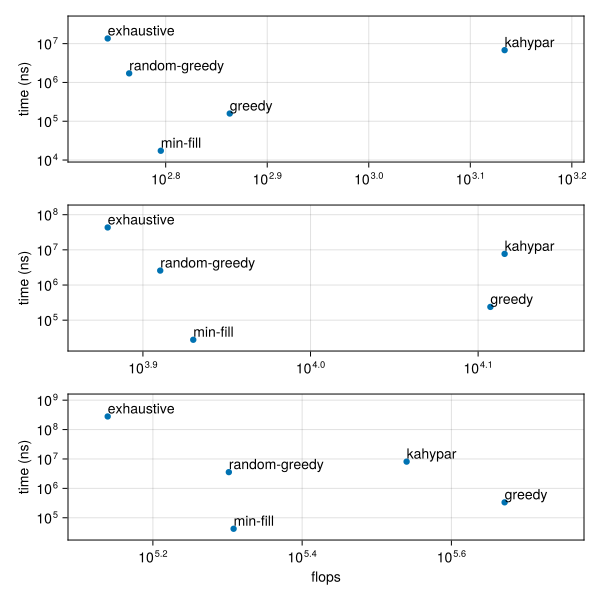
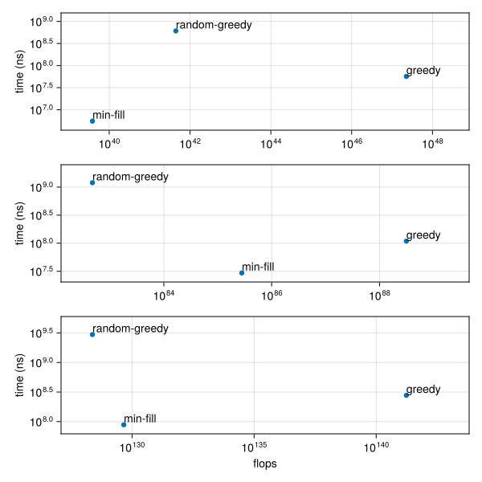

# Benchmarks

To run these benchmarks, navigate to the `benchmark` directory and run the following command.
```
julia --project make.jl
```
## Random Regular Graph

### |V| = 16



### |V| = 512


